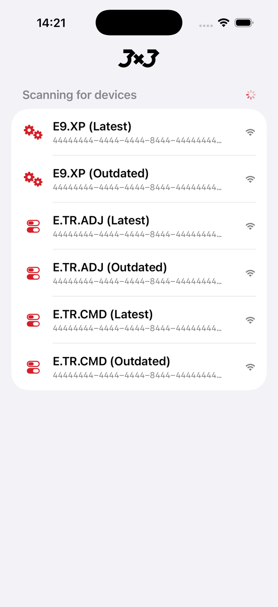
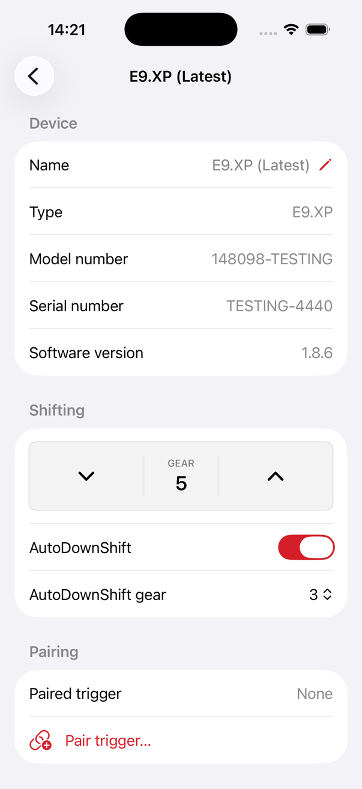
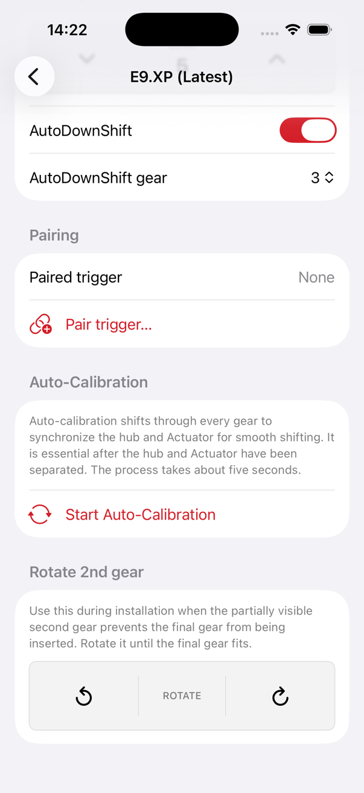
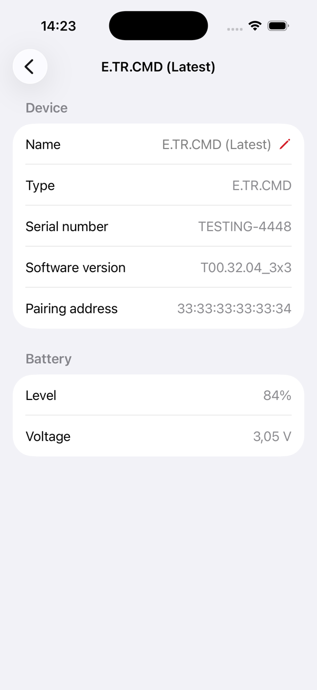
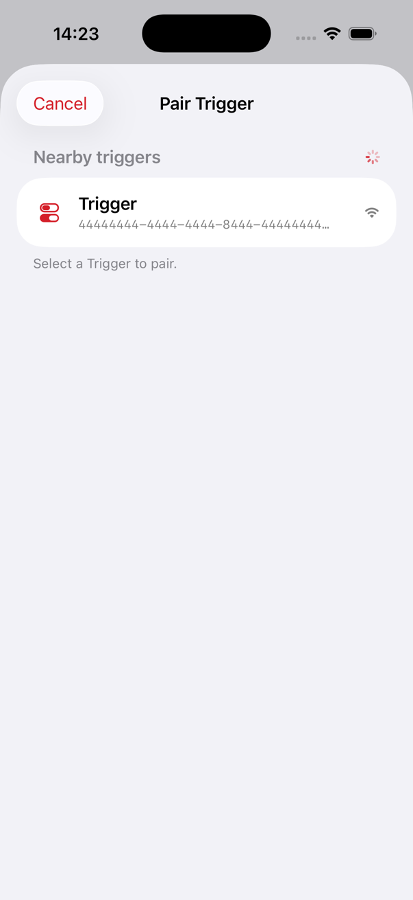
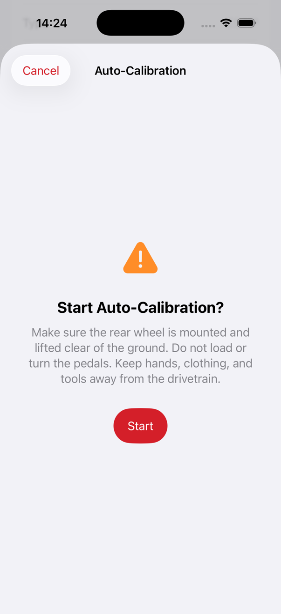

# 3X3 Service App for iOS

A native SwiftUI service app for 3X3 Actuator and Trigger devices. It uses
CoreBluetooth directly and implements the protocol behavior documented from
the 3X3 Service Tool and physical hardware tests.

> [!WARNING]
> This is an independent, unofficial project. It is not affiliated with,
> endorsed by, sponsored by, or supported by 3X3. The app communicates with
> physical drivetrain components and may change device settings or cause
> mechanical movement. Use it entirely at your own risk. To the fullest extent
> permitted by law, the project owner and contributors accept no responsibility
> or liability for device malfunction, damage, injury, data loss, warranty
> issues, or any other consequences resulting from use of this software.

## Screenshots

| Device discovery | Actuator view #1 | Actuator view #2 |
| --- | --- | --- |
|  |  |  |

| Trigger view | Pairing view | Auto-calibration view |
| --- | --- | --- |
|  |  |  |

## Features

- Discover and connect to supported Actuator and Trigger devices over Bluetooth LE
- Assign persistent local names to individual Actuator and Trigger devices
- Read device identity, firmware, and discovered GATT characteristics
- Read the current Actuator position and shift up or down
- Run Actuator auto-calibration with model-aware completion handling
- Rotate the second gear in either direction for installation alignment
- Read and configure Actuator AutoDownShift state and target gear
- Read Trigger battery level
- Read Actuator pairing state and initiate Trigger pair or unpair operations
- Export connection and GATT diagnostics after a failed connection
- Exercise the interface without hardware using testing Actuator and Trigger devices

Native firmware installation and device-log retrieval are not currently implemented.

## Requirements

- macOS with Xcode supporting Swift 6
- iOS 17 or later
- A physical iPhone for Bluetooth hardware testing
- [XcodeGen](https://github.com/yonaskolb/XcodeGen) to generate the Xcode
  project

The Swift package also supports macOS 14 or later for unit tests.

## Generate the Xcode Project

The Xcode project is generated locally from `project.yml` and is not checked
into version control. Generate it before opening the app, and regenerate it
after changing the project definition:

```sh
brew install xcodegen
xcodegen generate
```

`project.yml` contains the current signing team. Use your own development team
when building on another Apple developer account.

## Run the App

1. Open `3X3Service.xcodeproj` in Xcode.
2. Select the `3X3Service` scheme.
3. Select an iPhone and configure signing for your development team if needed.
4. Build and run.
5. Wake the Actuator or Trigger before connecting.

The app starts scanning automatically. Pull down on the device list to restart a
scan. A connection attempt times out after ten seconds when a device does not
respond.

Set `ADD_TESTING_DEVICE_ENTRIES` in the app's launch environment to add simulated
Actuator and Trigger entries in any build configuration. This allows the main UI
and workflows to be exercised without nearby hardware. Real BLE behavior still
requires a physical iPhone and device.

## Test and Validate

Run the protocol library's unit tests:

```sh
swift test
```

Build the iOS app from the command line for a simulator:

```sh
xcodebuild \
  -project 3X3Service.xcodeproj \
  -scheme 3X3Service \
  -destination 'generic/platform=iOS Simulator' \
  CODE_SIGNING_ALLOWED=NO \
  build
```

## Project Structure

- `Sources/3X3ServiceApp/`: SwiftUI application and Bluetooth workflow state
- `Sources/ThreeByThreeKit/`: discovery, GATT sessions, protocol framing,
  authentication, shifting, settings, and pairing
- `Tests/ThreeByThreeKitTests/`: protocol and model unit tests
- `Docs/protocol.md`: living protocol specification and evidence record
- `project.yml`: XcodeGen project definition

## Protocol Evidence

See [Docs/protocol.md](Docs/protocol.md) for UUIDs, frame formats, parameter
layouts, hardware observations, and unresolved behavior. Claims are labeled as
bundle-confirmed, hardware-confirmed, inferred, or unknown. Passing tests and
implemented code are not treated as protocol evidence by themselves.

Pairing and persistent unpairing have been confirmed with the tested physical
Actuator and `TSW001` Trigger. That Trigger firmware does not expose parameter table
113; the app instead uses the MAC address carried by its pairing-mode
manufacturer data. Keep devices recoverable with the official service workflow
when testing writes on other hardware or firmware versions.

## Contributing Protocol Findings

When adding or changing protocol behavior:

1. Record the source and evidence level in `Docs/protocol.md`.
2. Preserve complete parameter tables when only known fields are changed.
3. Add captured request and response bytes where available.
4. Add or update focused tests for framing, parsing, and mutation behavior.
5. Distinguish a successful write acknowledgement from verified persistence.

## License

This project is licensed under the [GNU General Public License version 3
only](LICENSE) (`GPL-3.0-only`).
